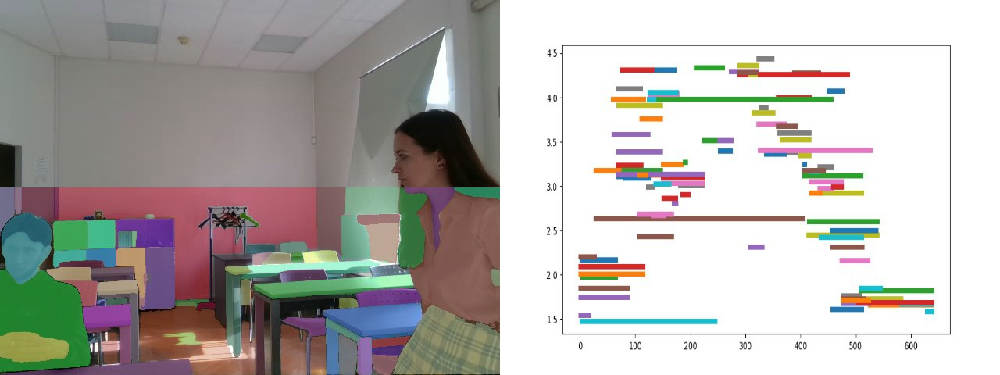

# Построение карты препятствий

Представлен проект для построения карты препядтсвий и детекции живого/не живого объекта для робота.

## Начало работы

Этот проект включает в себя обработку и анализ двух типов кадров: **RGB** и **Depth (глубина)**. Процесс работы разделяется на несколько ключевых этапов:

1. **Сегментация RGB изображения**
   - Используя метод *SAM*, мы сегментируем RGB-изображение на отдельные участки.

2. **Определение средней глубины сегмента**
   - Для каждого выделенного участка RGB-изображения мы вычисляем среднюю глубину, используя данные из кадра глубины.

3. **Обнаружение живых объектов**
   - С помощью алгоритма *YOLO* определяются координаты ограничивающих рамок (bounding boxes) для живых объектов в кадре.

4. **Создание карты препятствий**
   - На основе полученных данных строится карта препятствий, которая отображает местоположение и размеры обнаруженных объектов.

### Предварительные требования

Нам понадобятся веса для SAM и YOLO
- [Веса для SAM](https://huggingface.co/n0r9st/segment-anything/resolve/main/sam_vit_h_4b8939.pth?download=true)
- [Веса для YOLO](https://pjreddie.com/media/files/yolov3.weights)

Для корректной работы вам необходимо добавить файлы весов в следующую директорию проекта:

**YOLO**
📁 `obstacle-map`
  └── 📁 `yolo`
      └── 📁 `yolo_w`
          └── 📄 `yolov3.weights` *(вставьте сюда ваши веса модели)*

**SAM**
📁 `obstacle-map`

### Установка

Проверьте, установлены ли у вас все библиотеки из requirements.

Если нет, то их можно установить через терминал командой

    pip install -r requirements.txt

## Документация Sphinx 

Для проекта была написана документация, которая находится в папке 📁 `docs`. Найти и открыть веб-страницу с документацией можно тут

📁 `obstacle map`
  └── 📁 `docs`
      └── 📁 `build`
          └── 📁 `html`
              └── 📄 `index.html`

## Авторы

  - **Евгений Иванин**
  - **Кирилл Блинов**
  - **Юлия Несмеянова**
  - **Булат Аскаров**
